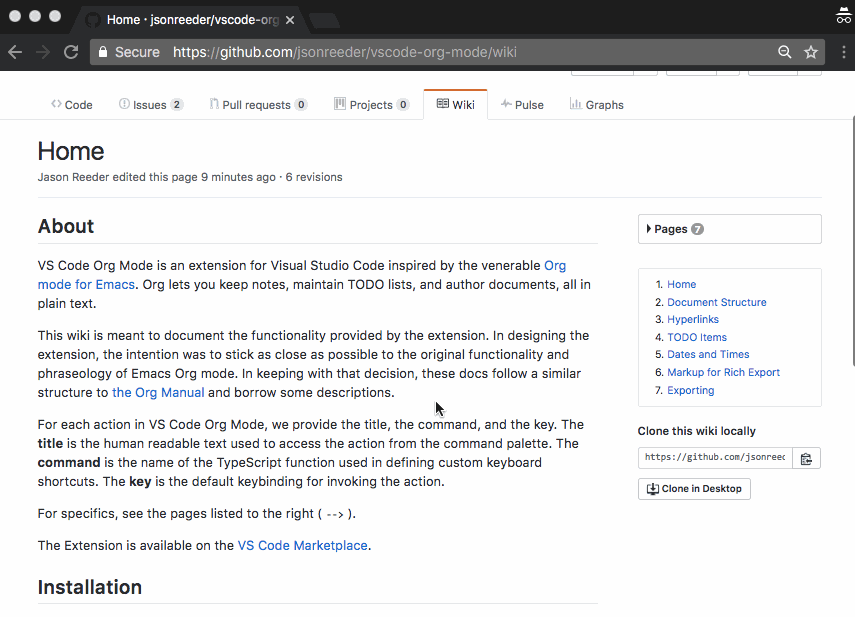

# VS Code Org Mode

**VS Code Org Mode** is an extension for [Visual Studio Code](https://code.visualstudio.com/) inspired by the venerable [Org mode for Emacs](http://orgmode.org/).

Org lets you keep notes, maintain TODO lists, and author documents, all in plain text.

## Features

### Keep Notes

Create outlines:

Promote and demote items:

### Maintain TODO Lists

Create TODOs:

Change TODO status:

Customize your TODO Keywords:

Insert timestamps:

Modify dates:

### Author Documents

Style your text:

Add metadata with a snippet:

Add links with a snippet:

Add comments:

## Get it

Install Org Mode from the `Extensions` tab in VS Code:

## Learn More

Find Org Mode on the [VS Code Marketplace](https://marketplace.visualstudio.com/items?itemName=tootone.org-mode):

Explore the source code on the repo, [vscode-org-mode](https://github.com/jsonreeder/vscode-org-mode), and the complete documentation on the [wiki](https://github.com/jsonreeder/vscode-org-mode/wiki):

VS Code Org Mode is an open-source project. We welcome contributions and feature requests. See the repo for contribution guidelines.
